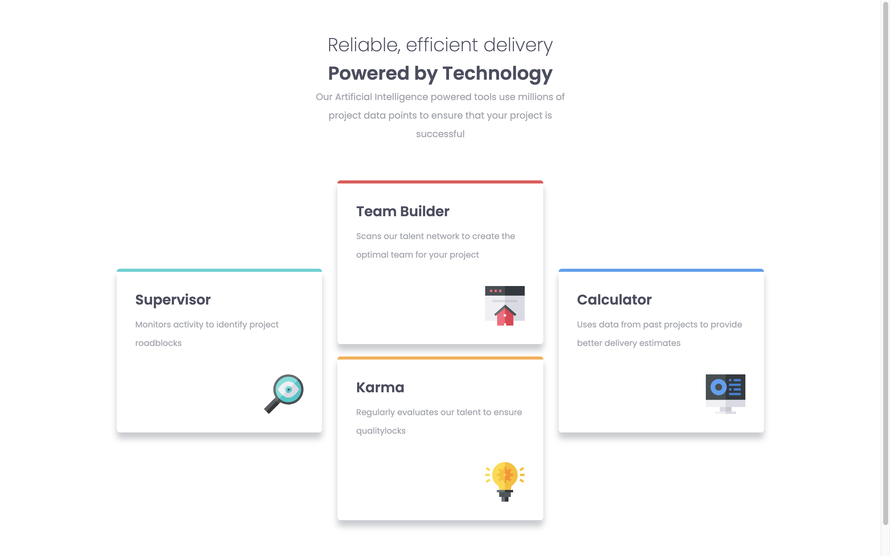

# Frontend Mentor - Four card feature section solution

This is a solution to the [Four card feature section challenge on Frontend Mentor](https://www.frontendmentor.io/challenges/four-card-feature-section-weK1eFYK). Frontend Mentor challenges help you improve your coding skills by building realistic projects.

## Table of contents

- [Overview](#overview)
  - [The challenge](#the-challenge)
  - [Screenshot](#screenshot)
  - [Links](#links)
- [My process](#my-process)
  - [Built with](#built-with)
  - [What I learned](#what-i-learned)
  - [Continued development](#continued-development)
- [Author](#author)

## Overview

### The challenge

Users should be able to:

- View the optimal layout for the site depending on their device's screen size

### Screenshot

### Links

- Solution URL: [https://github.com/lahn0528/four-card-feature-section](https://github.com/lahn0528/four-card-feature-section)
- Live Site URL: [https://lahn0528.github.io/four-card-feature-section/](https://lahn0528.github.io/four-card-feature-section/)

## My process

### Built with

- Semantic HTML5 markup
- Flexbox

### What I learned

TIL margin collapsing which happens when two vertical margins come in contact with one another. One solution is to use only margin-top or margin-bottom.

### Continued development

I was not able to add space to the bottom of the screen in tablet and mobile mode without messing up the sizes of the four cards.

## Author

- Frontend Mentor - [@lahn0528](https://www.frontendmentor.io/profile/lahn0528)
